# Question 1 : Clustering and PCA

## Run the PCA and Clustering

### Clustering part

### Assess : Clustering

#### Color

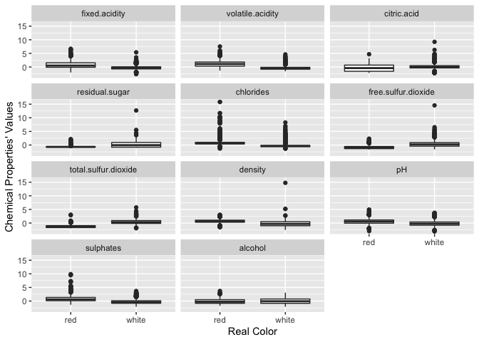
According to this figure, we can see that we may distinguish wines by
fixed.acidity and volatile.acidity

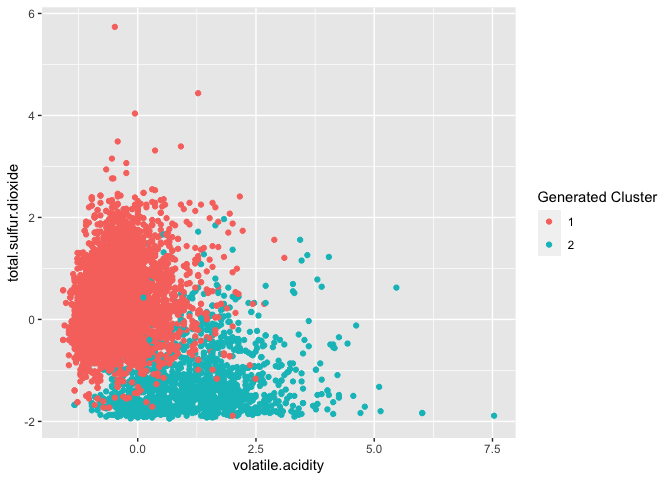
By clustering, We can see that one group is on the left, and the other
group is on the right.

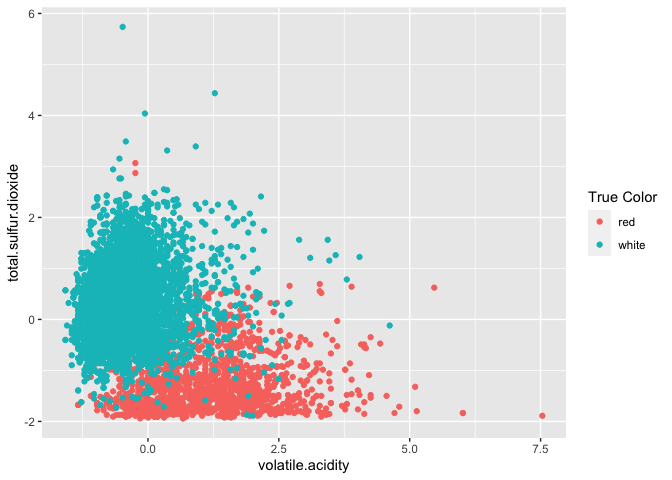

This is the true color group of wines, compare to the above
figure(clustering), we can see that clustering can help us distinguish
the color of wine.

#### Quality

Now we are going to see that whether clustering works for quality Now we
see the true quality figure
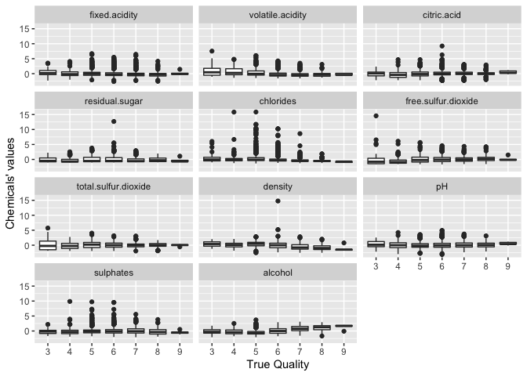
We can see that these figures are very disordered, so we can’t use it to
determine Because it is difficult to see which one can help us to
distinguish, so we decide to use mean value of them to see which may
work.
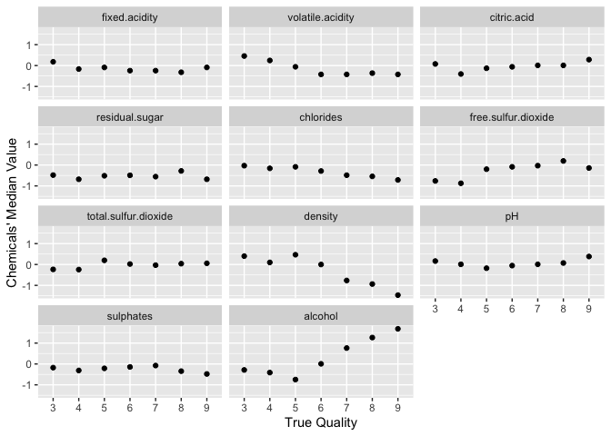
We can see that there are 4 properties(alcohol,density,citric.acid and
Free.sulfur.dioxide) may be used to distinguish the quality because they
looks like they have some trends.

##### clustering labels

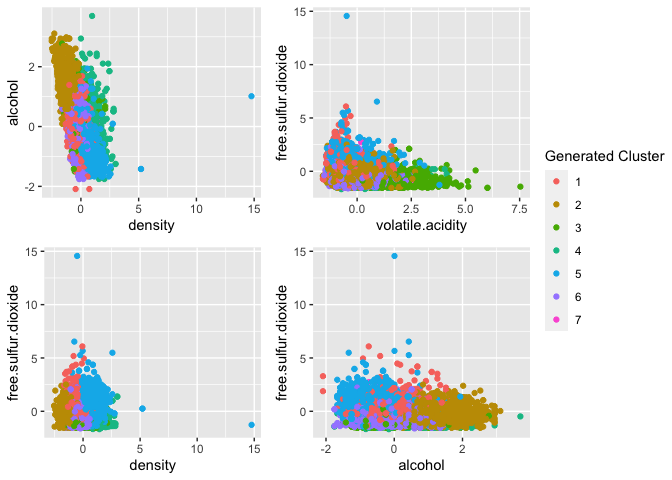
We can see that we still can’t catch the difference among wines
accurately,

##### Orginal label

Now we see the true quality of wines
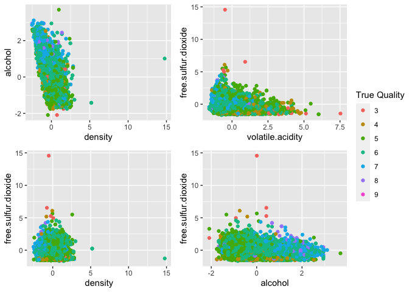
Compare the above 2 figures, we can know that it’s very difficult to
distinguish the quality of wines by use clustering.

### PCA part

#### colors

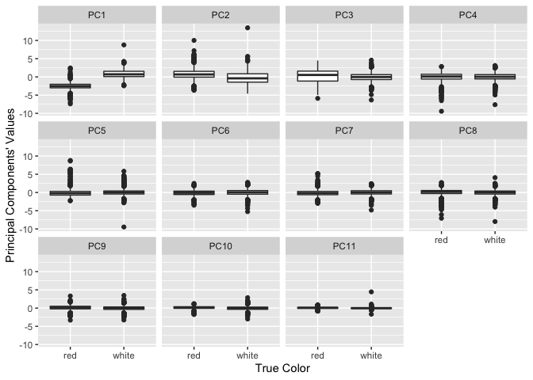
From this figure, we can see that PC1 and PC2 may have some trends, so
we may use it to distinguish color of wines

Then we plot it into one figure to see their abilities of distinguish

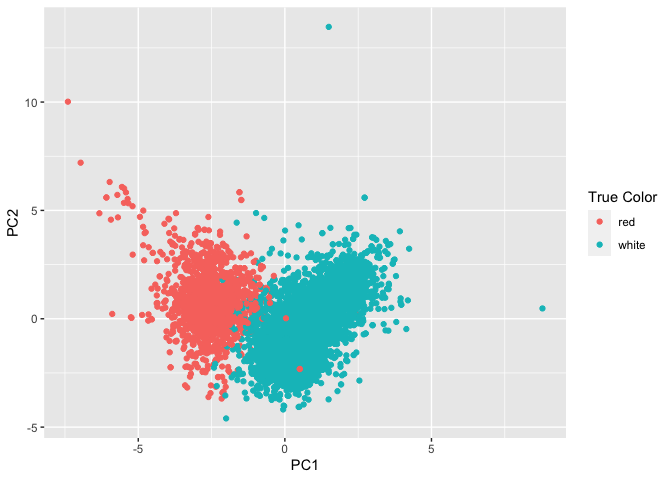
We can see that the points in the left are usually red wines, in the
right are usually white wines. So PCA can distinguish the color of wines
successfully.

#### quality

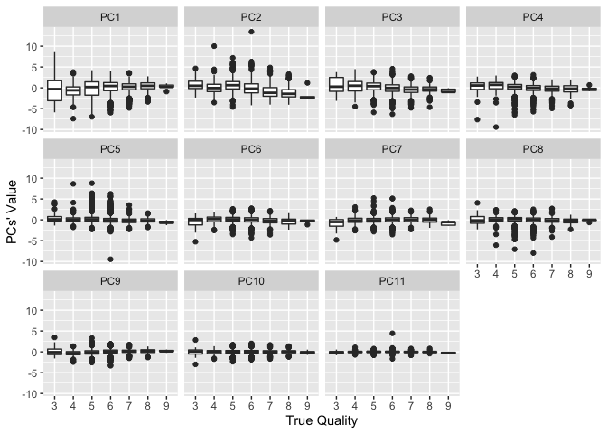

From this figure, we can see that it’s difficult to distinguish the
qualities by PCA

In order to assure this statement, we decide to use the median values to
find which PC have ability to distinguish the qualities

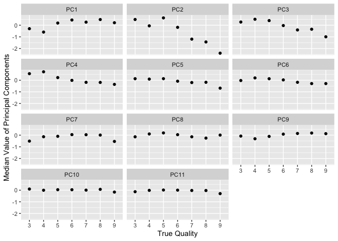
From this figure, we can see that PC2 and PC3 may help us to distinguish
the qualities

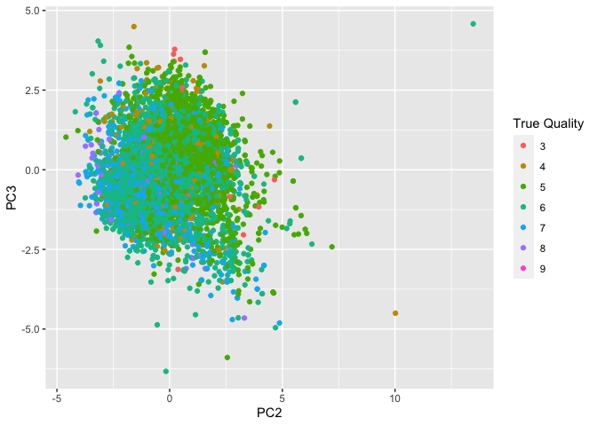
However, according to this figure, we still can’t use PCA to distinguish
the quality successfully.

## Conclusion

Whether PCA or Clustering, they can distinguish the colors of wines
successfully, but both of them can’t distinguish the qualities of wines
Although PCA is better than Clustering, but it still doesn’t have good
ability to distinguish the qualities of wines
